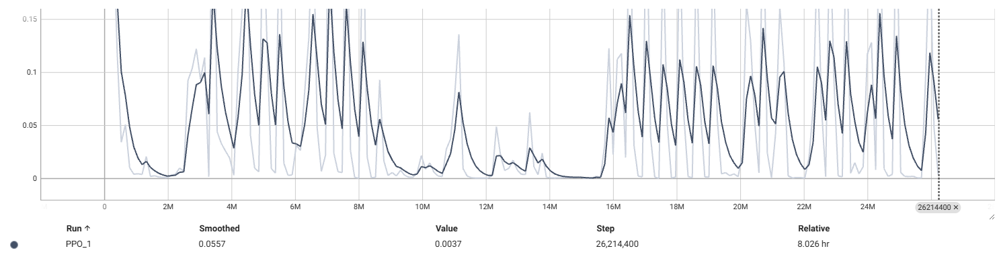
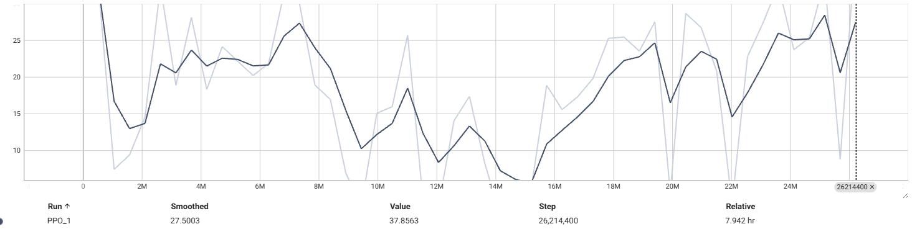
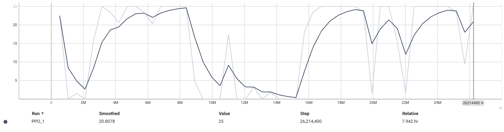
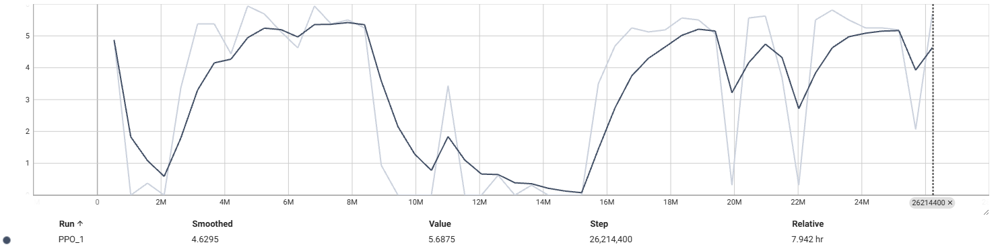

# Phase 0: Foundations — Proof of Concept

## Overview

Phase 0 is the foundation layer of the Pokémon Red Hierarchical RL project. The goal was straightforward: **prove that a PPO agent can learn meaningful behavior in Pokémon Red from RAM-based observations alone.** The goal wasn't to beat the game, but to learn about building the environment, training infrastructure, and reward system needed to support everything that comes next.

Success for phase 0 was simple: can the agent consistently pick a starter Pokémon? That requires navigating from the player's bedroom, through Pallet Town, to Professor Oak's lab, and interacting with the correct sequence of dialogues and menus. All in all, a non-trivial sequence of ~50+ precise actions for an agent that starts knowing nothing.

## How the Code Works

The system has three core files:

**`pokemon_env.py`** — A Gymnasium-compatible environment wrapper around the PyBoy Game Boy emulator. On each `step()`, it presses a button, ticks the emulator forward, reads game state directly from RAM addresses (player position, map ID, battle flag, party data, event flags), and computes a reward. The observation space is a structured vector of RAM-derived values - no pixels or CNN.

**`train_rl.py`** — The training script. Runs PPO (via Stable-Baselines3) across 16 parallel emulator instances using `SubprocVecEnv`. Includes a custom `RewardLoggerCallback` that tracks per-episode rewards broken down by component (exploration, events, levels, step penalty), action distributions, and rolling statistics. Logs to TensorBoard. A `MetadataCheckpointCallback` saves JSON sidecars alongside model checkpoints with training metadata.

**`constants.py`** — Centralized configuration for RAM addresses, reward values, action mappings, event flag definitions, and timing parameters. Keeps magic numbers out of the environment and training code.

The training loop works like this:
1. 16 PyBoy instances load the same save state (standing in Pallet Town bedroom)
2. Each instance runs independently, collecting experience
3. After `n_steps` per environment, PPO computes a policy update
4. Metrics are logged and the cycle repeats

## Initial Goal: Consistently Getting a Starter

The first milestone was reaching 100% starter pickup rate across evaluation runs. This required the agent to learn a specific sequence: walk downstairs, exit the house, walk to route 1, trigger the Oak encounter, navigate the dialogue, and select a Pokémon.

My most successful model was one that trained for ~10 million timesteps, the agent achieved **100% starter pickup** on non-deterministic evaluation runs.

## What I Learned

### Reward Shaping Drives Everything

The most impactful lesson from Phase 0 was how sensitive the agent's behavior is to reward magnitudes. Early reward configurations over-weighted the starter pickup event. When I ran the trained model in deterministic evaluation mode, I discovered that **A was the most-pressed button by a wide margin.** The agent had learned that pressing A was associated with high reward (since A is required to advance through all the dialogues and menus during starter selection), so it defaulted to spamming A regardless of context.

Similarly, **B was the second most-pressed button** because it allowed the agent to escape menus and dialogues to resume exploring — which meant more exploration reward. The agent wasn't learning nuanced navigation; it was learning "press A for event rewards, press B to get back to exploring."

This required refining the reward system to balance exploration incentives against event rewards, so directional movement and strategic button presses had meaningful value relative to A/B spam.

### Hyperparameters Matter More Than Expected

I went through several rounds of hyperparameter tuning. My initial configuration was conservative and borrowed from generic PPO recommendations:

| Parameter | Initial | Final | Why It Changed |
|-----------|---------|-------|----------------|
| `n_steps` | Low (~2048) | 16,384 (= `MAX_STEPS_PER_EP`) | Pokémon is a long-horizon game. Short rollouts meant the agent only saw fragments of trajectories — it would start walking north but the rollout would end before reaching any payoff. Full-episode rollouts let actual rewards propagate back through the entire trajectory. |
| `batch_size` | 128 | 512 | Larger minibatches provided more stable gradient estimates across the diverse experience from 16 parallel envs. |
| `n_epochs` | 4 | 3 | Reduced to avoid overfitting on each rollout. With full-episode rollouts, the same data is already quite correlated — fewer passes helped. |
| `gamma` | 0.999 | 0.997 | Slightly less discounting. At 0.999, the agent weighted distant rewards almost equally to immediate ones, which introduced noise. 0.997 still supports long-horizon credit assignment while being more stable. |
| `ent_coef` | 0.01 | 0.02 | Increased entropy bonus to encourage continued exploration. The agent was collapsing to deterministic strategies too early (the A-spam problem). |

The biggest single improvement came from setting **`n_steps` equal to `MAX_STEPS_PER_EP`** (full-episode rollouts). This makes intuitive sense for Pokémon: the meaningful decision sequences span thousands of steps, and the agent needs to see how early actions lead to late rewards. Short rollouts force the value function to bridge the gap, and early in training, the value function isn't good enough to do that.

**Open question:** 
- Whether `n_epochs > 1` provides meaningful benefit for this problem. With full-episode rollouts from 16 envs, each PPO update already processes a large amount of correlated data. Multiple epochs over this data risk overfitting to specific trajectories. I plan to explore this in future phases.
- Whether reducing `n_steps` below `MAX_STEPS_PER_EP` can improve training stability without sacrificing long-horizon learning. A test run at `n_steps = MAX_STEPS_PER_EP // 4` (~26M timesteps) showed more frequent policy updates but degraded starter pickup from 100% to ~30% — suggesting that for Pokémon's long action sequences, full-episode rollouts may be necessary for the value function to learn accurate return estimates. This warrants further investigation with intermediate values (e.g., `MAX_STEPS_PER_EP // 2`).

### Training Dynamics: The Crash-Recovery Pattern

A consistent pattern across training runs was an early crash-recovery cycle in total reward. That is why I explored a lower `n_steps` to see if it could help with the oscillation I would see. However, as of now it seems to have just degraded performance.

*Value loss spikes correspond to periods where the policy shifts enough that the value function's predictions become inaccurate.*

*Exploration, event, and level (graph order) rewards move in lockstep — when the agent explores well, it also triggers events and gains levels.*

The cycle works like this:
1. **Early episodes:** Every tile is new, so exploration reward floods in. The policy updates to maximize this signal.
2. **Overshoot:** The policy over-commits to whatever trajectory scored highest. Next batch of experience doesn't match, and reward drops.
3. **Recovery:** PPO's clipping mechanism prevents catastrophic policy collapse, and the agent gradually relearns.
4. **Stabilization:** By ~episode 50, the cycle dampens and the policy converges.

This is visible in the TensorBoard curves — value loss, policy gradient loss, exploration reward, and event reward all show synchronized oscillations that attenuate over training.

**Entropy trended slightly upward** over training (from ~-2.0 to ~-1.85), which is unusual — typically entropy decreases as the policy becomes more confident. This may indicate the entropy coefficient is slightly high, preventing full convergence to a deterministic strategy.

## Results

| Metric | Value |
|--------|-------|
| Total timesteps | ~13M (50 episodes × 16 envs × 16,384 steps) |
| Starter pickup rate | **100%** on deterministic evaluation |
| Training time | ~8 hours wall clock |

The agent reliably navigates from the bedroom to Oak's lab, picks a starter, and defeats the rival. It does not consistently reach Route 1 within the current episode length — this is an episode truncation issue (`max_steps` was set to 16,384), not a learning failure.

## Future Goals

### General
- **Visualization** I'm currently unhappy with my set up for testing a model. I'd like to implement a way to watch all tested models run at the same time

### Immediate (Phase 1)
- **Increase `max_steps`** to 32,768+ to give the agent runway to reach Route 1 and beyond
- **Reach Viridian City** as the next navigation milestone
- **Optimize reward shaping** — balance exploration vs. event vs. level reward magnitudes to reduce A-spam behavior and incentivize directional navigation
- **Refine event flag handling** — add intermediate events between starter pickup and Pewter City to provide denser signal for longer trajectories

### Architecture (Phase 2)
- **Meta-controller implementation** — a learned policy-over-options that classifies game state (overworld, battle, menu, dialogue) and selects the appropriate sub-policy
- **Navigation sub-policy** — specialized overworld movement
- **Battle sub-policy** — decision-making under partial observability (opponent stats unknown), trained via standalone battle simulator for generalization
- **Rule-based menu policy** — deterministic menu handling

### Stretch
- **Obtain the Pokédex** — requires backtracking (Pallet Town → Route 1 → Viridian → back to Pallet), which is a harder exploration problem than forward progress
- **Defeat Brock (Boulder Badge)** — the project's ultimate Phase 2 target
- **Vision-based observations** — replace RAM reading with CNN over game frames as a documented stretch goal